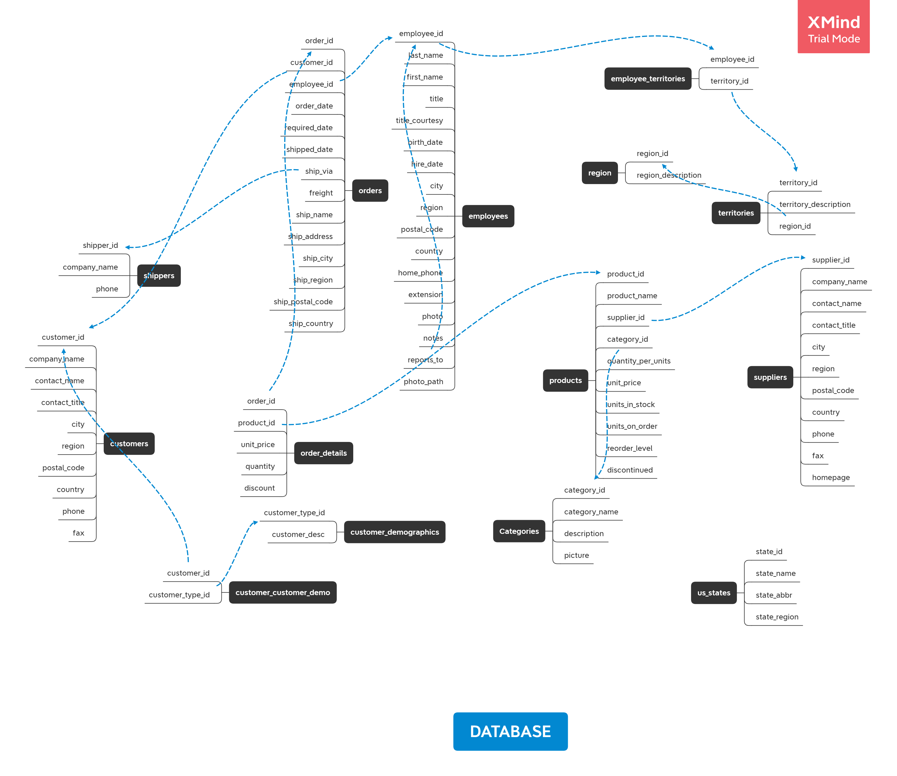
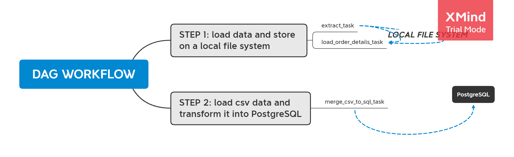

# 🛠️ Data Engineering Code Challenge

## 1. Introduction

Welcome to the **Data Engineering Code Challenge** for software developers! This project focuses on data pipelines, using the Northwind dataset from Microsoft (for educational purposes) and an additional CSV file named `order_details.csv` as part of the challenge.

### Objectives:
1. **Stage 1:**
   - Extract data from the PostgreSQL database and the `order_details.csv` file.
   - Save these extracted data into local file system directories, each containing respective tables. The `order_details` file itself will be treated as a table.
2. **Stage 2:**
   - Merge these files into a single PostgreSQL database.

### Technologies Used:
- Apache Airflow
- Meltano (Python) or Embulk (Java)
- PostgreSQL
- Libraries like `sqlalchemy`

## 2. Development

### Stage 1:
#### Data Handling:
1. Reviewed the `.sql` file to identify potential inconsistencies with the proposed database schema. 
2. Created a schema using XMind for comparison with the challenge instructions. Identified and resolved discrepancies, recording changes in `task_schedule.txt`. Adjusted NOT NULL constraints, revised foreign keys, and ensured primary key redundancy for proper table properties.
3. Planned to insert foreign keys for `order_details` referencing `orders` and `products` in the final step.

#### Pipeline Development:
1. Considered merging all data into a single dataframe using Pandas, but opted for Meltano for dynamic pipeline management.
2. Created functions for data extraction and loading using Meltano:
    - `extract_table_to_csv(table_name)`: Extracts each table from SQL and saves to the local file system.
    - `load_order_details()`: Loads the `order_details.csv` table and saves it to the local file system.
    
    python
    def extract_table_to_csv(table_name):
        # Function to extract data from PostgreSQL and save as CSV
        pass

    def load_order_details():
        # Function to load order_details.csv and save as CSV
        pass
    
   
    These functions operate independently, saving data in subdirectories for each table within the local file system.

### Stage 2:
#### Merging Files into PostgreSQL:
1. Used `sqlalchemy` to merge CSV files into a single PostgreSQL database in the `final_data` directory.
2. Added foreign keys for `order_details` referencing `orders` and `products`.

python
def merge_csv_to_sql():
    # Function to merge CSV files into a single PostgreSQL database
    pass

#### DAG Workflow:
python
extract_task >> merge_csv_to_sql_task
load_order_details_task >> merge_csv_to_sql_task

## 3. Conclusions

- This is a theoretical pipeline model, as not all necessary packages could be installed and tested on my system.
- This challenge allowed me to dive into data engineering, aligning with my career as a Backend Developer and Data Scientist.
- The pipeline could be improved by implementing a generic logic to handle an arbitrary number of tables.
- A lighter pipeline model could be discussed, optimizing system capacity usage.
- The improved model could feature an API for automatic SQL code adjustments.

Thank you for the opportunity to participate in this challenge. 
I am eager to work practically on pipeline development, 
exploring extensive possibilities in this field!

